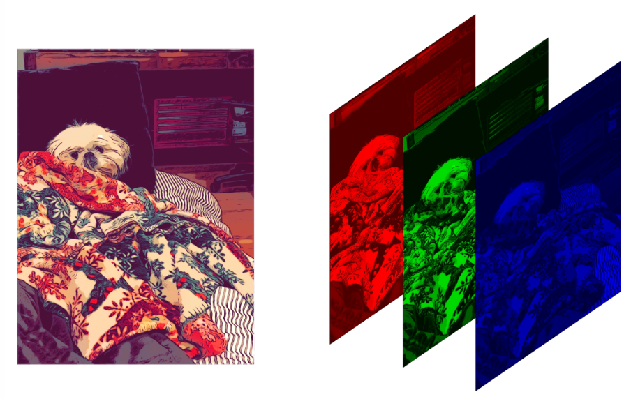
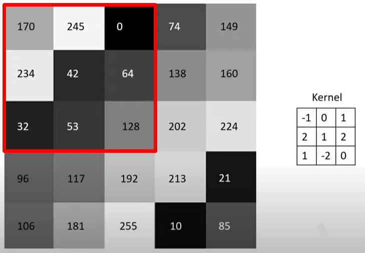
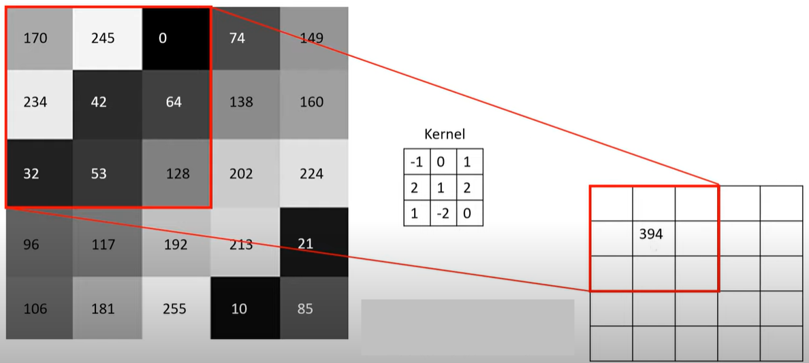
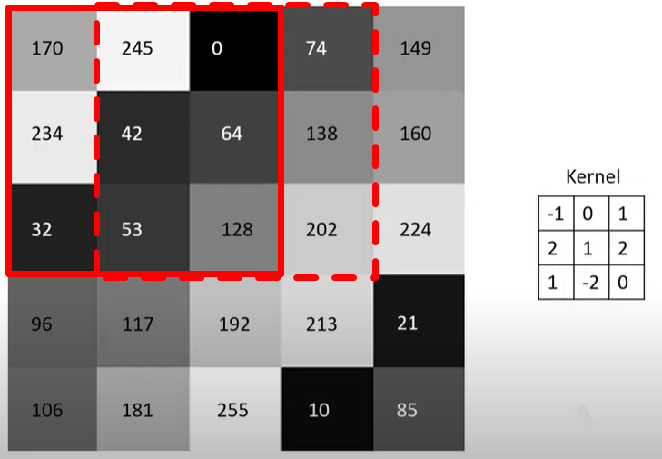
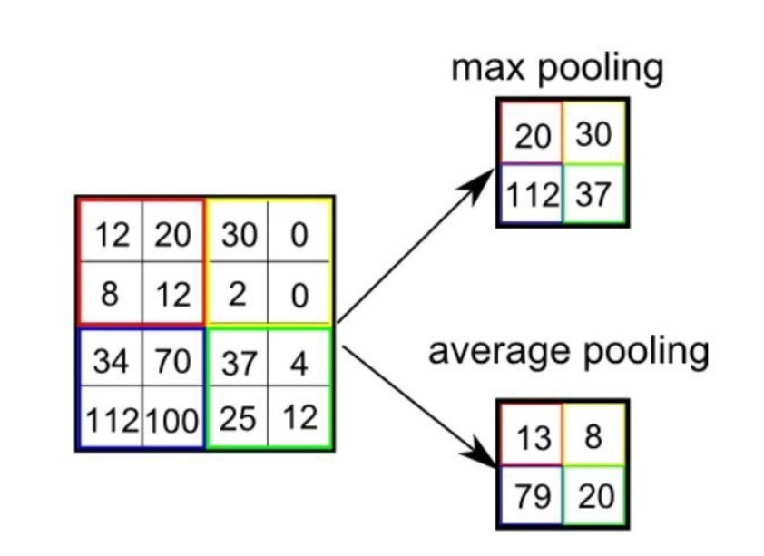
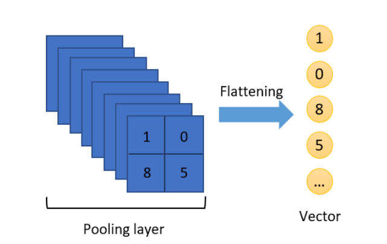

```{r setup, include=FALSE}
knitr::opts_chunk$set(echo = TRUE, warning = FALSE, message = FALSE)
library(reticulate)
use_python("C:/Users/datanerd/Documents/.virtualenvs/myenv/Scripts/python.exe")
```

Konvolüsyonel Sinir Ağı (Convolutional Neural Network-**CNN**), genellikle görsel bilginin analiz edilmesinde kullanılan bir Yapay Sinir Ağı (Artificial Neural Network-**ANN**) sınıfıdır.

En basit şekilde CNN'i aşağıdaki gibi tanımlayabiliriz.

```{r echo=FALSE, fig.cap="https://www.mdpi.com/2076-3417/9/21/4500", fig.align="center", out.width = "50%"}
knitr::include_graphics("img1.jpg")
```

Girdi (Input) bölümü uygulamamızdaki milletvekillerinin fotoğraflarıdır. Yani, verinin ham olarak ağa verildiği bölümdür. Konvolüsyon (Convolution) ve Ortaklama/Havuzlama (Pooling) denilen bölümde görsellerdeki özellikler yakalanır (feature extraction). Ardından Tam Bağlantı (Fully Connected) ve Çıktı (Output) denilen bölüme geçilir ve burada sınıflandırma (classification) gerçekleştirilir.

Konvolüsyon, ortaklama ve tam bağlantı katmanlarına yakından bakalım.

Konvolüsyon: Görselden belirli özelliklerin çıkarılması konvolüsyon katmanında olur. Bu katmanda, tüm görüntüye 2x2, 3x3, 5x5 gibi küçük boyutlu filtrelerin uygulanması yapılmaktadır. Böylelikle görüntüdeki daha ayırt edici özellikler çıkartılarak yeni bir görüntü elde edilir. AKP'li bir milletvekili ile CHP'li bir milletvekilini birbirinden ayıran özelliklerin belirleneceği katman konvolüsyon katmanı olacaktır.

Bu bölümü daha iyi anlayabilmek için bilgisayarın bir resmi nasıl okuduğuna bakalım.

Tüm renkler üç renkten oluşur: Kırmızı, Yeşil ve Mavi. Bunu RGB (Red, Green, Blue) olarak kısaltabiliriz. Bu uygulamada göreceğimiz resimler renklidir ve her biri RGB'den oluşuyor. Aynı zamanda renkli resimler 3 katmandan oluşur da diyebiliriz.

```{r echo=FALSE, fig.cap="Image Credit: Diane Rohrer", fig.align="center", out.width = "50%"}

```

Her renk 0 ile 255 arasında değer alır.

* RGB(255,0,0): Kırmızı

* RGB(0,255,0): Yeşil

* RGB(0,0,255): Mavi

Örnek olarak, RGB(87,51,100) ile oluşturduğum renk aşağıdadır.

```{r echo=FALSE, fig.cap="RGB(87,51,100)", fig.align="center", out.width = "50%"}
knitr::include_graphics("img3.jpg")
```

R'da RGB renklerinin yoğunluğunu örnek olarak seçtiğim bir tablo üzerinden aşağıdaki gibi inceleyebiliriz.

```{r echo=FALSE, fig.cap="The Kiss, Gustav Klimt", fig.align="center", out.width = "50%"}
knitr::include_graphics("img4.jpg")
```

```{r}

img4 <- EBImage::readImage("img4.jpg")
EBImage::hist(img4)

```

0'a yaklaştıkça koyuluk; 1'e yaklaştıkça açıklık artar. Örneğin, RGB(0,0,0) siyah; RGB(255,255,255) beyazdır.

Bakalım tabloda hangi renkler kullanılmış. Başta da öğrendiğimiz üzere bu renkler RGB'nin karışımı ile oluşur.

Aşağıdaki resim 1200x1204x3 boyutundadır ki bu da 4,334,400 piksel demektir.

```{r}

thekiss <- jpeg::readJPEG("img4.jpg")
m_thekiss <- RImagePalette::image_palette(thekiss, n = 20)
scales::show_col(m_thekiss)

```

Konumuzla pek alakalı değil ama madem yukarıdaki çıktıyı aldık, ekstra bir bilgi vermek isterim. Yukarıda görülen #'li değerler Hex/Hexadecimal (16 tabanlı sayı sistemi) kodudur ve RGB'yi temsil etmenin bir yoludur. Örneğin, RGB(255,0,0) kırmızıdır. Bunu Hex kodu ile #FF0000 şeklinde gösteririz. Burada # sonrası 6 digit vardır. İlk ikisi R, sonraki ikisi G ve kalan ikisi B'yi temsil eder. Peki, #FF0000 neden kırmızıdır? Hex sisteminde değerler, 0'dan 9'a kadar bildiğimiz rakamlar ile; 10'dan 16'ya kadar da sırasıyla A, B, C, D, E ve F ile temsil edilirler. O halde, FF'i şöyle çevirebiliriz:

$15 * (16^0) + 15 * (16^1) = 15 + 240 = 255$ ki bu da $R = FF_{16} = 255_{10}, G = 00_{16} = 0_{10}$ ve $B = 00_{16} = 0_{10}$'dur.

Devam edelim ve içinde bulunduğumuz konvolüsyon katmanında hesaplamanın nasıl yapıldığına bakalım.

```{r echo=FALSE, fig.cap="https://www.youtube.com/watch?v=1GUgD2SBl9A", fig.align="center", out.width = "50%"}
knitr::include_graphics("img5.jpg")
```

Yukarıda 5x5 boyutunda bir matris görüyoruz. Burada renkler matris şeklinde verilmiş. Sağda görülen 3x3'lük matris ise filtre (Kernel). Bu filtre soldaki matrisin üzerinde gezdirilir ve elde edilen değerler yeni matrise yazdırılır.

```{r echo=FALSE, fig.align="center", out.width = "50%"}

```

$(-1x170) + (0x245) + (1x0) + (2x234) + (1x42) + (2x64) + (1x32) + (-2x53) + (0x128) = 394$

```{r echo=FALSE, fig.align="center", out.width = "50%"}

```

Yukarıdaki işlemi bir ya da birkaç adım kaydırarak devam ettiririz. Burada, kodun içerisinde de göreceğimiz Stride'ın alacağı değer belirlenir. Stride ne kadar piksel kaydıracağımızı belirlediğimiz parametredir. Stride 1 olursa aşağıdaki gibi kaydırılır ve Kernel işlemine devam edilir.

```{r echo=FALSE, fig.align="center", out.width = "50%"}

```

Günün sonunda bu işlemler bittiğinde 3x3'lük bir çıktı matrisi (convolved feature) elde edilmiş olunur.

Peki, renkli bir resim için bu işlemler nasıl yapılır?

Yukarıdaki işlem 2 defa daha olmak üzere toplamda 3 defa yapılır (RGB üç boyutludur) ve elde edilen değerler toplanarak çıktı matrisine yazılır.

Ortaklama: Büyük bir resmin piksel sayısının azaltıldığı işlem ortaklama ile yapılır. Burada bir Max Pooling veya Average Pooling işlemi tercih edilir. Bu işlem ile resmin özellikleri kaybedilmeden boyut küçültmeye geçilir. Ayrıca, ortaklama ile görüntüdeki gürültü, yani görüntünün sınıflandırmaya katkıda bulunmayan öğeleri de filtrelenmiş olur. Uygulamada kullanacağımız fotoğraflar gürültüden uzak olacaktır.

```{r echo=FALSE, fig.cap="https://www.researchgate.net/figure/Max-pooling-and-average-pooling_fig5_343675998", fig.align="center", out.width = "50%"}

```

Yukarıda görüldüğü gibi burada da kaydırarak ya her penceredeki maksimum değeri ya da ortalama değeri alarak boyut küçültmüş oluyoruz.

Konvolüsyon ve ortaklama aşamaları istenildiği kadar tekrar ettirilebilir.

Tam Bağlantı: Tam bağlantıya kadar verilerimiz matris şeklinde gelir. Tam bağlantı katmanına geçmeden önce bir Flattening (düzleştirme) işlemi yapılır. Bu katman sınıflandırmada kullanılan standart sinir ağlarından oluşur.

Düzleştirme işlemini matristen vektöre dönüştürmek gibi düşünebiliriz.

```{r echo=FALSE, fig.cap="https://towardsai.net/p/machine-learning/beginner-guides-to-convolutional-neural-network-from-scratch-kuzushiji-mnist-75f42c175b21", fig.align="center", out.width = "50%"}

```

Öğrendiklerimizi toparlamak adına [şurada](https://poloclub.github.io/cnn-explainer/) CNN'i açıklayan çok güzel bir sayfanın adresini verebilirim. Örnek olarak pizza resmini seçtim. Buraya kadar öğrendiğimiz tüm bilgiler aşağıdaki resmin üzerinde yer almaktadır.

```{r echo=FALSE, fig.cap="https://poloclub.github.io/cnn-explainer/", fig.align="center", out.width = "50%"}
knitr::include_graphics("img11.jpg")
```

Bu uygulamada üzerinde çok durmayacağız ama birazdan model oluştururken Adam isimli bir optimizasyon algoritması kullanacağız. Sadece bunu neden yaptığımıza bakalım. Derin öğrenmede, öğrenme işleminin sağlıklı bir sonuca ulaşması için hata fonksiyonunun mutlak minimum değerinin bulunması gerekir. Bu da optimizasyon yöntemleri kullanılarak gerçekleştiriliyor. Hatayı en küçük yapmada (ağın ürettiği çıkış değeri ile gerçek değer arasındaki farkın minimizasyonu) kullanılan yöntemlere optimizasyon deniliyor. Yapay sinir ağlarında da optimizasyon için en çok kullanılan yöntemlerden biri Gradyan İnişi'dir (Gradient Descent). Optimizasyon algoritmalarında öğrenme katsayısının ayarlanması modelin eğitimi için kritiktir. Biz burada Adam'ı seçeceğiz.

Bunun dışında yine üzerinde çok durmayacağımız ama bilgimizin olmasında fayda olacak aktivasyon fonksiyonlarından bahsedelim. Aktivasyon fonksiyonları, bir katmanda bulunan nöronlara ait çıktı değerini sonraki katmanlara aktarırken kullanılır. Biz ReLU (Rectified Linear) ve Sigmoid'i kullanacağız. ReLU'da, giriş değeri sıfırın altında iken çıktı sıfırdır, ancak giriş değeri sıfırın üzerinde ise çıkış giriş değerine eşittir ve bağımlı değişkenle doğrusal bir ilişki oluşmaktadır. Sigmoid ise tanım kümesindeki elemanların her biri için 0-1 arasında bir değer üretir.

CNN'i anlatmak bu kadar basit değil tabiki de. Bu uygulama bir giriş niteliğinde olsun istedim. Umuyorum başlangıç için yeterli olmuştur.

***Uygulama bölümüne geçebiliriz.***

Bu çalışmada, TBMM'nin 27. dönem milletvekillerine ait fotoğrafları kullanacağız. Milletvekilleri sayı nedeniyle AKP ve CHP ile sınırlandırılmıştır. Yani, çalışmanın sonunda ikili bir sınıflandırma yapmış olacağız.

Verilere, çalışmanın sonunda paylaşacağım kod ile ulaşabileceğiniz gibi [GitHub hesabımdan](https://github.com/rpydaneogrendim/rblog/tree/main/data) *post14* dosyasını indirerek de ulaşabilirsiniz.

Detaylara geçmeden önce fotoğraflar ile ilgili bir not düşmek istiyorum. Bu çalışmada amacım süreç boyunca sadece yüze odaklanmak oldu. Yani, fotoğrafın geri kalanı ile ilgilenmek istemedim. Evet, CNN de resimler arasındaki farka odaklanır ve etiketlerin hangi özellik ile öne çıktığını öğrenir ancak kişisel deneyimim beni validasyonda da başarıyı arttıracak bir yola yönlendirdi. Bu çalışmaya ilk başladığımda bir fotoğrafın tamamını eğitmeye çalıştım ancak validasyon sırasında düşük doğrulama (accuracy) alıyordum. Çeşitli denemelerden sonra tatmin edici sonuç alamayınca (ki bu sürede PC de ciddi yoruluyor) yüzleri nasıl kırparım sorusuna cevap bulmaya çalıştım ve aşağıdaki paketler ve kod yardımı ile tüm yüzleri tespit ettirip yeni bir eğitim ve test seti yarattım.

Kullanacağımız paket [image.libfacedetection](https://github.com/bnosac/image) olacak. Bu paket, görüntülerdeki yüzleri algılamak için önceden eğitilmiş bir konvolüsyonel sinir ağı imkanı sunuyor.

```{r}

library(magick)
library(image.libfacedetection)

########## fotoğrafların isimlerinin aktarımı ##########

img_face_akp <- list.files("tbmm/training/AKP/", pattern = "*.jpg")
img_face_chp <- list.files("tbmm/training/CHP/", pattern = "*.jpg")
img_face_train <- c(img_face_akp,img_face_chp)
img_face_test <- list.files("tbmm/test/", pattern = "*.jpg")

########## fotoğrafların okutulması ##########

img_train_read <- list()
for(i in 1:length(img_face_train)){
  
  if(i <= length(img_face_akp)){
    
    img_train_read[[i]] <- image_read(paste0("tbmm/training/AKP/",img_face_train[i]))
    
  } else {
    
    img_train_read[[i]] <- image_read(paste0("tbmm/training/CHP/",img_face_train[i]))
    
  }
  
}

img_test_read <- list()
for(i in 1:length(img_face_test)){
  
  img_test_read[[i]] <- image_read(paste0("tbmm/test/",img_face_test[i]))
  
}

########## yüzlerin elde edilip kaydedilmesi ##########

# training:
for(i in 1:length(img_train_read)) {
  
  # Hata veren fotoğraf(lar) için tryCatch() koyuldu
  # Hatalı fotoğraf(lar) otomatik olarak silinmiş olacak
  
  tryCatch(
    expr = {
      
      face <- image_detect_faces(img_train_read[[i]])
      
      image_crop(
        img_train_read[[i]],
        geometry_area(
          x = face$detections$x,
          y = face$detections$y,
          width = face$detections$width,
          height = face$detections$height
        )
      ) -> imageCrop
      
      image_write(
        imageCrop,
        path = ifelse(i <= length(img_face_akp),
                      paste0("tbmm/training/AKP_face_only/", img_face_train[i]),
                      paste0("tbmm/training/CHP_face_only/", img_face_train[i])),
        format = "jpg"
      )
      
    },
    
    error = function(e) {
      message("Caught an error!",img_face_train[i])
    }
  )
  
}

# test:
for(i in 1:length(img_test_read)) {
  
  tryCatch(
    expr = {
      
      face <- image_detect_faces(img_test_read[[i]])
      
      image_crop(
        img_test_read[[i]],
        geometry_area(
          x = face$detections$x,
          y = face$detections$y,
          width = face$detections$width,
          height = face$detections$height
        )
      ) -> imageCrop
      
      image_write(
        imageCrop,
        path = paste0("tbmm/test/test_face_only/", img_face_test[i]),
        format = "jpg"
      )
      
    },
    
    error = function(e) {
      message("Caught an error!",img_face_test[i])
    }
  )
  
}

```

Eğitilecek veri setine ulaşalım. Eğitim (train) veri setinin içerisinde yer alan sınıfları iki dosyaya ayırdım: AKP ve CHP.

```{r}

library(keras)
library(tensorflow)
library(EBImage)

imgs_akp <- list.files("tbmm/training/AKP_face_only/")
imgs_chp <- list.files("tbmm/training/CHP_face_only/")
imgs <- c(imgs_akp,imgs_chp)

```

Toplamda `r length(imgs)` adet fotoğraf bulunmaktadır. Ancak eğitilecek veri seti dengesiz verilerden (imbalanced data) oluşmaktadır ki bu da bir problemdir. Aşağıda görüldüğü üzere AKP sınıfından `r length(grep("AKP",imgs))`; CHP sınıfından `r length(grep("CHP",imgs))` milletvekili bulunmaktadır.

```{r}

length(grep("AKP",imgs))
length(grep("CHP",imgs))

```

Burada, AKP daha fazla olduğu için AKP'den `r length(grep("AKP",imgs)) - length(grep("CHP",imgs))` adet milletvekilini random bir şekilde kaldırabiliriz. Seçtiğimiz bu yöntemin karşılığı Undersampling olarak geçiyor. Kolay bir yöntem olmasının yanında önemli bilgileri kaybetmemize büyük olasılıkla neden olacak da bir yöntemdir.

```{r}

imgs_akp <- grep("AKP",imgs, value = TRUE)
imgs_chp <- grep("CHP",imgs, value = TRUE)

imgs_akp <- imgs_akp[sample(1:length(imgs_akp),length(imgs_chp))]
removed_akp <- imgs[!(imgs %in% c(imgs_akp,imgs_chp))]
imgs <- imgs[imgs %in% c(imgs_akp,imgs_chp)]

```

Undersampling ile iki kategoriye de `r length(imgs)/2` fotoğraf vererek eğitim setini dengelemiş olduk.

Eğitim setindeki dosyaların içerisinde bulunan fotoğraflara ulaşalım.

```{r}

train <- list()
for(i in 1:length(imgs)){
  
  if(i <= length(imgs_akp)){
    
    train[[i]] <- readImage(paste0("tbmm/training/AKP_face_only/",imgs[i]))
    
  } else {
    
    train[[i]] <- readImage(paste0("tbmm/training/CHP_face_only/",imgs[i]))
    
  }
  
}

```

Şimdi de test seti dosyasındaki iki fotoğrafı alalım.

```{r}

imgs_test <- list.files("tbmm/test/test_face_only/")

test <- list()
for(i in 1:length(imgs_test)){
  
  test[[i]] <- readImage(paste0("tbmm/test/test_face_only/",imgs_test[i]))
  
}

```

Eğitim setindeki fotoğraflar birbirine yakın boyutlu olsalar da farklılık bulunmaktadır. Tüm fotoğrafları aynı boyutlu yapacağız. Aynı boyuta getirirken şuna dikkat etmeliyiz: Daha büyük boyutlar daha fazla özelliğe sahip olacaktır ancak daha büyük boyut aynı zamanda eğitim aşamasında daha çok zaman alacaktır. Tam tersi, daha küçük boyutta da işimize yarayacak özellikleri kaybetmiş olabiliriz. Bu noktada sanatımızı konuşturacağız. Ön bir inceleme ile 64x64 olabilir diye düşündüm.

```{r}

for(i in 1:length(imgs)){
  
  train[[i]] <- resize(train[[i]], 64, 64)
  
  if(i == length(imgs)){
    
    train <- combine(train)
    
  }
  
}

str(train)

```

Eğitim setindeki fotoğrafları bir araya getirdik. Bu fotoğraflar 64x64x3 boyutunda ve `r dim(train)[4]` adet.

```{r}

for(i in 1:length(imgs_test)){
  
  test[[i]] <- resize(test[[i]], 64, 64)
  
  if(i == length(imgs_test)){
    
    test <- combine(test)
    
  }
  
}

str(test)

```

Aynı şekilde, test setindeki fotoğrafları bir araya getirdik. Bu fotoğraflar 64x64x3 boyutunda ve `r dim(test)[4]` adet.

Fakat yukarıdaki format model aşamasında çalışmayacaktır. Aşağıdaki gibi yeniden sıralayıp çalışmasını sağlayacağız.

```{r}

train <- aperm(train, c(4,1,2,3)) # 268, 64, 64, 3
test <- aperm(test, c(4,1,2,3)) # 2, 64, 64, 3

```

Etiketleri belirleyelim.

```{r}

train_y <- c(
  rep(0,length(imgs_akp)), # AKP: 0
  rep(1,length(imgs_chp)) # CHP: 1
)

test_y <- c(
  0, # AKP
  1 # CHP
)

```

Kategorik değişkenleri ikili olarak temsil eden One Hot Encoding yapacağız.

```{r}

trainLabels <- to_categorical(train_y)
testLabels <- to_categorical(test_y)

```

İlk kolonun AKP'yi; ikinci kolonun CHP'yi temsil ettiğini görebiliriz.

```{r}

head(trainLabels)
tail(trainLabels)

```

Model kurma aşamasına geçmeden önce Keras ve Tensorflow'a bakalım.

Keras, Python ile yazılmış etkili bir üst düzey sinir ağı API'dır. Keras kütüphanesi CNTK, TensorFlow ve Theano üzerinde çalışabilir. TensorFlow ise uçtan uca açık kaynak bir derin öğrenme framework'üdür. Yani, derin öğrenme için geliştirilmiş açık kaynak bir matematik kütüphanesidir.

Şimdi modele geçebiliriz.

```{r}

model <- keras_model_sequential(name = "CNN") %>%
  layer_conv_2d(
    filters = 8,
    kernel_size = c(5, 5),
    activation = "relu",
    input_shape = c(64, 64, 3)
  ) %>% # Convolution, ReLU
  layer_max_pooling_2d(pool_size = c(3, 3)) %>% # Max Pooling
  layer_flatten() %>% # Flattening
  layer_dense(units = 16,
              activation = "relu") %>% 
  layer_dense(units = 2,
              activation = "sigmoid",
              name = "Output") %>% 
  compile(
    loss = "binary_crossentropy",
    optimizer = optimizer_adam(), # Adam
    metrics = "accuracy"
  )

```

```{r}

history <- model %>% 
  fit(
    train,
    trainLabels,
    epochs = 50,
    batch_size = 64,
    validation_split = 0.1 # 10%'luk kısım validasyon için ayrıldı
  )

plot(history)

```

Aşağıda hata matrisi (confusion matrix) oluşturalım.

```{r}

library(tidyverse)

train_prob <- model %>% 
  predict(train) %>% 
  as.data.frame() %>% 
  rename("AKP"=1,"CHP"=2) %>% 
  mutate("Actual" = if_else(train_y == 0, "AKP", "CHP")) %>% 
  mutate("Pred" = if_else(AKP > 0.5, "AKP", "CHP"))

tbl1 <- table(Predicted = train_prob$Pred, Actual = train_prob$Actual)
tbl1

```

Hata matrisine göre `r tbl1[1,1] + tbl1[2,2]` milletvekilinin partisini doğru; `r tbl1[1,2] + tbl1[2,1]` milletvekilinin partisini yanlış tahmin etti. Buradan da Doğruluk oranı (Accuracy rate) `r (tbl1[1,1] + tbl1[2,2]) / (tbl1[1,1] + tbl1[2,2] + tbl1[1,2] + tbl1[2,1])` olur.

```{r}

test_prob <- model %>% 
  predict(test) %>% 
  as.data.frame() %>% 
  rename("AKP"=1,"CHP"=2) %>% 
  mutate("Actual" = if_else(test_y == 0, "AKP", "CHP")) %>% 
  mutate("Pred" = if_else(AKP > 0.5, "AKP", "CHP"))

tbl2 <- table(Predicted = test_prob$Pred, Actual = test_prob$Actual)
tbl2

```

Test verilerini kullandığımızda karşımıza aşağıdaki gibi bir sonuç çıkmaktadır.

```{r, echo=FALSE, preview=TRUE}

df <- data.frame(
  Test = c("Recep Tayyip Erdoğan", "Kemal Kılıçdaroğlu"),
  AKP = c(test_prob[1,1],test_prob[2,1]),
  CHP = c(test_prob[1,2],test_prob[2,2]),
  Img = c("https://pbs.twimg.com/profile_images/1151410974240444416/yVvaD7hU_400x400.jpg",
          "https://pbs.twimg.com/profile_images/1446836678832922629/UB3uap87_400x400.jpg")
) %>% 
  pivot_longer(!c(Test,Img), names_to = "Party", values_to = "Prob")

ggplot(df, aes(x = Test, y = Prob, fill = Party)) +
  geom_bar(stat = "identity", position = "dodge", alpha = .5) +
  ggimage::geom_image(aes(image = Img), size = 0.15,
                      position = position_dodge(width = 0.9)) +
  scale_fill_manual(values = c("orange","red")) +
  theme_minimal() +
  theme(plot.title = element_text(face = "bold", hjust = 0.5),
        legend.title = element_blank()) +
  scale_y_continuous(limits = c(0,1)) +
  labs(title = "İki Politik Liderin Yüzleri Hangi Olasılıkla Hangi Partiye Ait?",
       y = "Olasılık", x = "")

```

Erdoğan'ın AKP'li bir yüze sahip olma olasılığı `r round(test_prob[1,1], digits = 2)` iken; Kılıçdaroğlu'nun CHP'li bir yüze sahip olma olasılığı `r round(test_prob[2,2], digits = 2)`

Bu uygulamanın ardından güzel bir Shiny Web uygulaması yapıp paylaşmak isterdim ancak hem veri setinin yetersiz oluşu hem de etik sebepler ile böyle bir şeyi paylaşmayı uygun görmedim. Çalışmaya konu veri setindeki fotoğrafların bugün itibarıyla hangi etiketin/sınıfın/kategorinin/partinin içinden olduğu net bir şekilde bellidir ancak dışarıdan uygulamaya girecek bir fotoğraf için bu tahmin şu şartlarda riskli olabilir. Çalışmanın eğitim amaçlı paylaşıldığını ve bu alanda neler yapılabileceği konusunda fikir vermeyi amaçladığını belirtmek isterim.

Çalışmanın diğer kodlarına aşağıdan ulaşabilirsiniz.

```{r eval=FALSE}

# Python entegrasyonu

library(reticulate)
use_python("C:/Users/.../Documents/.virtualenvs/myenv/Scripts/python.exe")

# Web kazıma ile verilerin elde edilmesi

library(rvest)
library(tidyverse)

urlsList <- read_html("https://www.tbmm.gov.tr/Milletvekilleri/liste") %>% 
  html_nodes("div.col-md-8 a") %>% 
  html_attr("href") %>% 
  as.data.frame() %>% 
  rename("urls"=1) %>% 
  mutate(urls = paste0("https://www.tbmm.gov.tr",urls))

partyList <- read_html("https://www.tbmm.gov.tr/Milletvekilleri/liste") %>% 
  html_nodes("div.col-md-4.text-right") %>% 
  html_text() %>% 
  as.data.frame() %>% 
  rename("party"=1) %>% 
  mutate(party = str_trim(party),
         party = gsub("İ","I",party),
         party = gsub("Ğ","G",party))

master <- cbind(urlsList,partyList) %>% 
  filter(party %in% c("AK Parti","CHP")) %>% 
  mutate(party = if_else(party == "AK Parti","AKP",party))

for(i in 1:nrow(master)){
  
  img_mop <- read_html(master$urls[i]) %>% 
    html_nodes("img") %>% 
    .[[3]] %>% 
    html_attr("src")
  
  download.file(img_mop,
                paste0("C:/.../", # fotoğrafların ineceği yer
                       master$party[i],"_",i,".jpg"), mode = "wb")
  
}

# Test görselleştirme

df <- data.frame(
  Test = c("Recep Tayyip Erdoğan", "Kemal Kılıçdaroğlu"),
  AKP = c(test_prob[1,1],test_prob[2,1]),
  CHP = c(test_prob[1,2],test_prob[2,2]),
  Img = c("https://pbs.twimg.com/profile_images/1151410974240444416/yVvaD7hU_400x400.jpg",
          "https://pbs.twimg.com/profile_images/1446836678832922629/UB3uap87_400x400.jpg")
) %>% 
  pivot_longer(!c(Test,Img), names_to = "Party", values_to = "Prob")

ggplot(df, aes(x = Test, y = Prob, fill = Party)) +
  geom_bar(stat = "identity", position = "dodge", alpha = .5) +
  ggimage::geom_image(aes(image = Img), size = 0.15,
                      position = position_dodge(width = 0.9)) +
  scale_fill_manual(values = c("orange","red")) +
  theme_minimal() +
  theme(plot.title = element_text(face = "bold", hjust = 0.5),
        legend.title = element_blank()) +
  scale_y_continuous(limits = c(0,1)) +
  labs(title = "İki Politik Liderin Yüzleri Hangi Olasılıkla Hangi Partiye Ait?",
       y = "Olasılık", x = "")

```
