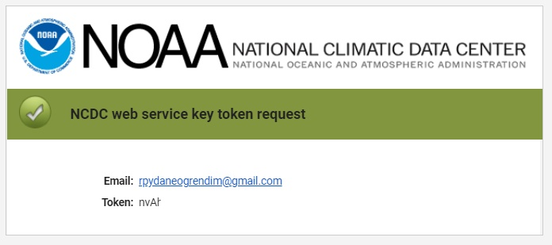

```{r setup, include=FALSE}
knitr::opts_chunk$set(echo = TRUE)
```

NOAA (National Oceanic and Atmospheric Administration/Ulusal Okyanus ve Atmosfer Dairesi), Amerika Birleşik Devletleri'nin Dünya'daki hava ve deniz olaylarını araştırması amacıyla görevlendirilmiş bir kurumudur. 1807 yılında kurulmuş olan NOAA, hava, deniz ve gökyüzündeki tehlikeleri araştırıp, okyanus ve kıyı kaynaklarının korunması konusunda araştırma ve geliştirme yapmaktadır ([*Vikipedi*](https://tr.wikipedia.org/wiki/Ulusal_Okyanus_ve_Atmosfer_Dairesi)).

NOAA'den faydalanabilmek için öncelikle bir token almak gerekiyor. [Şu adresten](https://www.ncdc.noaa.gov/cdo-web/token) ilgili sayfaya ulaşılabilir. Yapılması gereken adımlar sitede yazmaktadır. Bir mail adresi girerek submit butonuna tıklayın. *An email has been sent containing your CDO web services token* mesajından sonra mailinizi kontrol edin. Örnek olması için gelen mail görüntüsünü paylaşıyorum.

```{r pressure, echo=FALSE, out.width = '100%'}

```

NOAA'den verileri çekebilmek için rnoaa paketini kullanacağız.

```{r}

library(tidyverse)
library(ggridges)

#install.packages("rnoaa")
library(rnoaa)

myToken <- "..."

```

```{r, echo=FALSE}
myToken <- "nvAhkwNFuuGsgmqudSXbTEmyIeMcugZu"
```

Önce Türkiye'deki istasyonların listesini alalım. ghcnd_stations() fonksiyonunda kullanacağımız id sütununun ilk iki harfi ülke kodunu temsil etmektedir. Türkiye için bu TU'dur.

```{r}

countries <- ghcnd_countries() %>% 
  filter(name == "Turkey") %>% 
  pull(code)

# id: The weather station’s ID number. The first two letters denote the country
# (using FIPS country codes).

stations <- ghcnd_stations() %>% 
  filter(grepl(paste0("^",countries), id))

```

Siz bundan sonrasında istediğiniz istasyon ile devam edebilirsiniz. Ben bu yazıda İstanbul için bir uygulama yapacağım.

Aşağıdaki filtreleri yapalım.

* name sütunu İstanbul olsun.

```{r}

# name: The station’s name.

```

* element sütununda TAVG olsun. TAVG, ortalama sıcaklığı temsil ediyor.

```{r}

# TAVG: Average temperature, in tenths of degrees Celsius

```

* Son ölçüm yılı olan last_year 2022 olsun.

```{r}

# last_year: The last year of data available at that station for that weather element.

```

* İlk ölçüm yılı olan first_year değişkeni de en eski yıl olsun.

```{r}

# first_year: The first year of data available at that station for that weather element.

```

Filtreleyelim.

```{r}

istanbul <- stations %>% 
  select(id,name,element,first_year,last_year) %>% 
  filter(
    grepl("ISTANBUL",name) & element == "TAVG" & last_year == 2022
  )

```

Yukarıdaki filtreye göre 1 tane istasyon kaldı. O da bundan sonra kullanacağımız TUM00017064 id'li istasyondur.

Bu istasyondaki ulaşabileceğimiz verilere bakalım.

```{r}

myStation <- ncdc_datatypes(stationid = "GHCND:TUM00017064",
                            datasetid = "GHCND",
                            token = myToken)$data

```

```{r echo=FALSE}

myStation %>%
  kableExtra::kbl() %>%
  kableExtra::kable_styling()

```

Verileri çekelim.

```{r eval=FALSE}

avg34 <- ncdc(
  datasetid = "GHCND",
  stationid = "GHCND:TUM00017064",
  datatypeid = "TAVG",
  startdate = "2014-01-01",
  enddate = "2022-07-31",
  token = myToken,
  units = "metric",
  limit = 1000
)$data

```

Yukarıdaki kodu çalıştırdığımızda tarih aralığının 1 yıldan az olması gerektiğini belirten *The date range must be less than 1 year* uyarısını alacağız.

O halde şöyle yapalım: Elimizde 1 yıllık farklı aralıklarda tarihler olsun ve bir döngü yardımı ile hepsine ulaşalım.

```{r}

df_date <- data.frame(
  "StartDate" = (Sys.Date()-1)-365,
  "EndDate" = Sys.Date()-1
)

for(i in 2:9){
  
  df_date[i,2] <- df_date[(i-1),1] - 1
  df_date[i,1] <- df_date[i,2] - 365
  
}

df_date <- df_date %>% 
  arrange(StartDate)

```

```{r echo=FALSE}

df_date %>%
  kableExtra::kbl() %>%
  kableExtra::kable_styling()

```

Yukarıdaki tabloda yer alan her bir satır 1 yıllık aralıklar ile oluşturulan tarihlerdir. Her bir satır için verileri çekelim.

```{r}

df_avg34 <- data.frame()

for(i in 1:nrow(df_date)) {
  
  avg34 <- ncdc(
    datasetid = "GHCND",
    stationid = "GHCND:TUM00017064",
    datatypeid = "TAVG",
    startdate = as.character(df_date[i, 1]),
    enddate = as.character(df_date[i, 2]),
    token = myToken,
    units = "metric",
    limit = 1000
  )
  
  df_avg34 <- df_avg34 %>%
    bind_rows(
      data.frame(
        "Date" = avg34$data$date,
        "AvgTemp" = avg34$data$value
      )
    )
  
}

```

Elde ettiğimiz veri setindeki minimum ve maksimum tarih aralıklarına bakalım.

```{r eval=FALSE}

df_avg34 %>% 
  slice(1,nrow(.))
  
```

```{r echo=FALSE}

df_avg34 %>% 
  slice(1,nrow(.)) %>% 
  kableExtra::kbl() %>%
  kableExtra::kable_styling()

```

Tabloda yer alan ortalama sıcaklıkları 10'a böldüğümüz zaman doğru değerlere ulaşacağız. Çünkü ham veride herhangi bir ondalık yer almıyor. Bunun yanında tarihlerin yer aldığı sütunu da tarih formatına çevirmemiz gerekiyor.

```{r}

df_avg34$AvgTemp <- df_avg34$AvgTemp / 10
df_avg34$Date <- as.Date(substr(df_avg34$Date,1,10))

```

```{r echo=FALSE}

df_avg34 %>% 
  slice(1,nrow(.)) %>% 
  kableExtra::kbl() %>%
  kableExtra::kable_styling()

```

Sıcaklık verileri ile çalıştığım zaman ggridges paketini kullanmaya özen gösteriyorum. Bu paket ile özel bir görselleştirme türü olan Ridgeline veya Joy plot kullanılabilir.

Tarihlerden ayları ve yılları elde edelim ve grafiği ay sayısına bölüp yukarıda belirttiğim Ridgeline'ı yapalım.

```{r preview=TRUE, fig.width=10, fig.height=10}

df_avg34_split <- df_avg34 %>% 
  mutate(
    "Year" = format(as.Date(Date),"%Y"),
    "Month" = factor(
      format(as.Date(Date),"%B"),
      levels = c("Ocak","Şubat","Mart","Nisan","Mayıs","Haziran",
                 "Temmuz","Ağustos","Eylül","Ekim","Kasım","Aralık")
    )
  ) %>% 
  mutate(
    Year = forcats::fct_rev(Year)
  )

ggplot(df_avg34_split, aes(x = AvgTemp, y = Year, fill = stat(x))) +
  geom_density_ridges_gradient(scale = 3, rel_min_height = 0.01) +
  scale_fill_viridis_c(option = "C") +
  facet_wrap(~Month) +
  theme_minimal() +
  theme(axis.title = element_blank(),
        legend.position = "top",
        legend.title = element_blank(),
        strip.text = element_text(size = 20),
        plot.title = element_text(face = "bold", hjust = 0.5)) +
  labs(title = "İstanbul'da Hava Sıcaklıkları, 2014-2022")

```

Son olarak, aylara göre ortalamada en sıcak yılın hangisi olduğuna bakalım.

```{r fig.width=8, fig.height=5}

df_avg34_split %>% 
  select(-Date) %>% 
  group_by(Year,Month) %>% 
  summarise(AvgTemp = mean(AvgTemp)) %>% 
  ungroup() %>% 
  group_by(Month) %>% 
  filter(AvgTemp == max(AvgTemp)) %>% 
  ggplot(aes(x = Month, y = AvgTemp, fill = AvgTemp)) +
  geom_col() +
  geom_text(aes(label = paste0(Year,"\n(",round(AvgTemp, digits = 1),")")), vjust = 1.5) +
  theme_minimal() +
  theme(axis.title = element_blank(),
        legend.title = element_blank()) +
  scale_fill_gradient(low = "turquoise", high = "red")

```