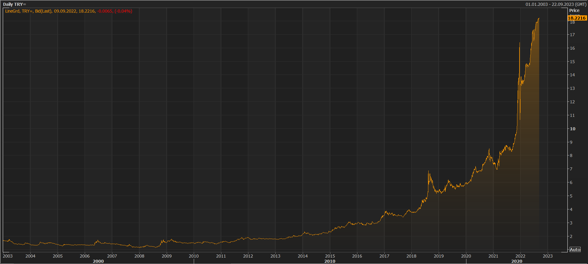

```{r setup, include=FALSE}
knitr::opts_chunk$set(echo = TRUE)
```

It is critical to convey data through beautiful visualizations in addition to being rich in data. Reuters is a platform where I can provide an example of what I just said.

In this post, we will use ggplot2 to create a Reuters-style chart. I'd like to emphasize that our goal is not to make exactly the same thing, but to capture the main style.

```{r echo = FALSE, out.width = "100%"}

```

You are free to use any data you want, but if you want to use the data from this post, download the *post26.xlsx* file [here](https://github.com/rpydaneogrendim/rblog/tree/main/data).

```{r}

library(tidyverse)

df <- readxl::read_excel("data.xlsx") %>% 
  mutate(
    date = lubridate::ymd(date)
  )

```

```{r fig.width=10, fig.height=7}

ggplot(df, aes(x = date, y = close)) +
  geom_line() +
  theme_minimal()

```

Making the line orange could be a good starting point.

```{r fig.width=10, fig.height=7}

ggplot(df, aes(x = date, y = close)) +
  geom_line(color = "#ffa500") +
  theme_minimal()

```

Darken the background.

```{r fig.width=10, fig.height=7}

ggplot(df, aes(x = date, y = close)) +
  geom_line(color = "#ffa500") +
  theme_minimal() +
  theme(
    plot.background = element_rect(fill = "#262626")
  )

```

Change the colors of the grid lines.

```{r fig.width=10, fig.height=7}

ggplot(df, aes(x = date, y = close)) +
  geom_line(color = "#ffa500") +
  theme_minimal() +
  theme(
    plot.background = element_rect(fill = "#262626"),
    panel.grid = element_line(color = "#4c4c4c")
  )

```

Make the axis texts white, remove the axis titles and place y-axis on the right.

```{r fig.width=10, fig.height=7}

ggplot(df, aes(x = date, y = close)) +
  geom_line(color = "#ffa500") +
  theme_minimal() +
  theme(
    plot.background = element_rect(fill = "#262626"),
    panel.grid = element_line(color = "#4c4c4c"),
    axis.title = element_blank(),
    axis.text = element_text(color = "#ffffff")
  ) +
  scale_y_continuous(position = "right")

```

Finally, we may have made the most significant contribution here. The area under the line will be filled and its transparency will be adjusted in this step.

```{r fig.width=15, fig.height=10, preview=TRUE}

ggplot(df, aes(x = date, y = close)) +
  geom_line(color = "#ffa500", size = 1, alpha = 0.9) +
  geom_area(alpha = 0.1, fill = "#ffa500") +
  theme(
    plot.background = element_rect(fill = "#262626"),
    panel.background = element_blank(),
    panel.grid = element_line(color = "#4c4c4c"),
    axis.title = element_blank(),
    axis.text = element_text(color = "#ffffff", size = 20)
  ) +
  scale_y_continuous(position = "right")

```

Someone looking at the chart will most likely identify it as a Reuters type chart! :-)

Don't forget about your contributions!