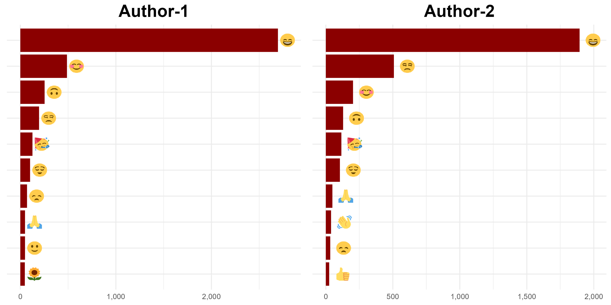

```{r setup, include=FALSE}
knitr::opts_chunk$set(echo = TRUE, eval = FALSE)
```

Emojis are widely used, and data & text analysis should take them into account. The good news is that it's not a big deal to get emojis and use them in the analysis.

I'll show you how to get emojis from WhatsApp chats. To get your own, follow the steps outlined [here](https://faq.whatsapp.com/196737011380816/?locale=en_US). Why not give them a little surprise?

You can easily import whatsapp chats downloaded in txt format into R using the {rwhatsapp} package.

```{r}

library(rwhatsapp)
library(ggimage) # ggimage::geom_image()
library(tidyverse)

```

```{r}

chat <- rwa_read("wp.txt")

```

The column names are listed below.

* time

* author

* text

* source

* emoji

* emoji_name

We'll be interested in the author and emoji columns.

```{r}

df <- chat %>% 
  select(author,emoji)

```

We can obtain the most frequently used emojis after importing the emoji data.

```{r}

emoji_data <- emojis %>% 
  mutate(
    hex_runes = gsub("\\s.*", "", hex_runes), # ignore combined emojis
    emoji_url = paste0("https://abs.twimg.com/emoji/v2/72x72/",tolower(hex_runes), ".png")
    # E.g. https://abs.twimg.com/emoji/v2/72x72/1f60b.png
  )

```

Top 10 emojis used by the Author-1:

```{r}

df %>%
  unnest(emoji) %>%
  count(author, emoji, sort = TRUE) %>%
  filter(author == "Author1") %>% 
  top_n(n = 10, n) %>%
  left_join(emoji_data, by = "emoji") %>% 
  ggplot(aes(x = reorder(emoji, n), y = n)) +
  geom_col(fill = "dark red") +
  geom_image(aes(y = n + 100, image = emoji_url)) +
  theme_minimal() +
  theme(axis.text.y = element_blank(),
        axis.title = element_blank(),
        plot.title = element_text(face = "bold", size = 20, hjust = 0.5)) +
  scale_y_continuous(labels = scales::comma) +
  coord_flip() +
  labs(title = "Author-1") -> g1
  
```

Top 10 emojis used by the Author-2:

```{r}

df %>%
  unnest(emoji) %>%
  count(author, emoji, sort = TRUE) %>%
  filter(author == "Author2") %>% 
  top_n(n = 10, n) %>%
  left_join(emoji_data, by = "emoji") %>% 
  ggplot(aes(x = reorder(emoji, n), y = n)) +
  geom_col(fill = "dark red") +
  geom_image(aes(y = n + 100, image = emoji_url)) +
  theme_minimal() +
  theme(axis.text.y = element_blank(),
        axis.title = element_blank(),
        plot.title = element_text(face = "bold", size = 20, hjust = 0.5)) +
  scale_y_continuous(labels = scales::comma) +
  coord_flip() +
  labs(title = "Author-2") -> g2
  
```

You can save the image with the code snippet shown below.

```{r}

g <- gridExtra::arrangeGrob(g1, g2, nrow = 1)
ggsave(file="wp.jpg", g, width = 10, height = 5)

```

```{r echo=FALSE, eval=TRUE, out.width = "100%", preview=TRUE}

```