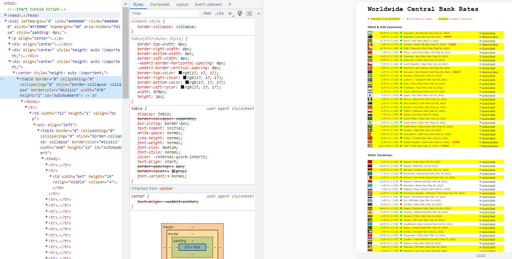

```{r setup, include=FALSE}
knitr::opts_chunk$set(echo = TRUE)
```

[In the previous post](https://urazakgul.github.io/rblog/posts/2022-10-09-post37/), I shared a chart of central bank interest rates. We'll see how we can customize the table on the site, which I've included below.

```{r echo=FALSE, out.width = '100%'}
knitr::include_graphics("img1.png")
```

When we right-click on the page and select *inspect*, we can see that the data is in the *table* element below.

```{r echo=FALSE, out.width = '100%'}

```

Using the table element makes scraping much simpler.

```{r}

library(rvest)
library(dplyr)
library(stringr)
library(lubridate)
library(ggplot2)

```


```{r}

url <- "https://www.cbrates.com/"

irs <- read_html(url) %>% 
  html_table()

```

The code above will generate a list in the environment when it is executed. The table we want to get to is the fourth item on the list.

```{r}

master <- irs %>% 
  .[[4]]

```

The table is somewhat disorganized. The first 10 lines are provided below.

```{r echo=FALSE}

master %>% 
  head(10) %>% 
  kableExtra::kbl(align = "c") %>% 
  kableExtra::kable_paper(full_width = F)

```

It's time to put our hand on the table.

The first two lines can be removed as they won't work for us.

```{r}

master <- master %>% 
  slice(-c(1,2))

```

```{r echo=FALSE}

master %>% 
  head(5) %>% 
  kableExtra::kbl(align = "c") %>% 
  kableExtra::kable_paper(full_width = F)

```

The first and fourth column can be removed.

```{r}

master <- master %>% 
  select(-c(1,4))

```

```{r echo=FALSE}

master %>% 
  head(5) %>% 
  kableExtra::kbl(align = "c") %>% 
  kableExtra::kable_paper(full_width = F)

```

We'll extract five pieces of information from the final version of the above table: Country, date of interest rate decision, interest rate, basis point, and sign.

The countries in the second column appear before the "|" symbol, and we can easily extract them using the stringr package's word() function.

```{r}

master <- master %>% 
  mutate(
    "Country" = word(X3,1,sep = "\\|")
  )

```

```{r echo=FALSE}

master %>% 
  head(5) %>% 
  kableExtra::kbl(align = "c") %>% 
  kableExtra::kable_paper(full_width = F)

```

The dates of interest decisions can be extracted from the same column. The important thing to understand is how to get a string inside parentheses. After obtaining the strings in parentheses, the values can be converted to date format using the lubridate package's mdy() function.

```{r}

# master <- master %>% 
#   mutate(
#     "DecisionDate" = gsub("[\\(\\)]", "", regmatches(X3, gregexpr("\\(.*?\\)", X3))),
#     "DecisionDate" = mdy(DecisionDate)
#   )

# OR

master <- master %>% 
  mutate(
    "DecisionDate" = mdy(gsub("[\\(\\)]", "", regmatches(X3, gregexpr("\\(.*?\\)", X3))))
  )

```

```{r echo=FALSE}

master %>% 
  head(5) %>% 
  kableExtra::kbl(align = "c") %>% 
  kableExtra::kable_paper(full_width = F)

```

The word() function can still be used to obtain interest rates from the first column.

```{r}

master <- master %>% 
  mutate(
    "InterestRate" = word(X2,1,1)
  )

```

```{r echo=FALSE}

master %>% 
  head(5) %>% 
  kableExtra::kbl(align = "c") %>% 
  kableExtra::kable_paper(full_width = F)

```

Finally, as in the second column, the strings in parentheses, i.e. basis points, can be obtained from the first column. We can find the base points by converting these values to numbers and multiplying them by 100. According to the standard basis point conversion, one percent of a percentage change equals one hundred basis points. As a result, the standard conversion will be, 100 basis points = 1% percentage change or 0.01% percentage change = 1 basis point.

```{r}

master <- master %>% 
  mutate(
    "BasisPoint" = gsub("[\\(\\)]", "", regmatches(X2, gregexpr("\\(.*?\\)", X2)))
  )

```

```{r echo=FALSE}

master %>% 
  head(5) %>% 
  kableExtra::kbl(align = "c") %>% 
  kableExtra::kable_paper(full_width = F)

```

Let's get the "+" and "-" signs at the beginning of the points in the last column and remove them from the column. These signs will be used later. The stringr's word() function will also come in handy here.

```{r}

master <- master %>% 
  mutate(
    "Sign" = word(BasisPoint,1,1)
  )

```

```{r echo=FALSE}

master %>% 
  head(5) %>% 
  kableExtra::kbl(align = "c") %>% 
  kableExtra::kable_paper(full_width = F)

```

We can leave the columns in the table that will be useful to us.

```{r}

master <- master %>% 
  select(3:7)

```

```{r echo=FALSE}

master %>% 
  head(5) %>% 
  kableExtra::kbl(align = "c") %>% 
  kableExtra::kable_paper(full_width = F)

```

There are extra spaces in the Country and BasisPoint columns, as can be seen. We can get rid of them by using the str_squish() function from the stringr package.

```{r}

master <- master %>% 
  mutate(
    Country = str_squish(Country),
    BasisPoint = str_squish(BasisPoint)
  )

```

```{r echo=FALSE}

master %>% 
  head(5) %>% 
  kableExtra::kbl(align = "c") %>% 
  kableExtra::kable_paper(full_width = F)

```

Let's just leave the points in the BasisPoint column.

```{r}

# master <- master %>% 
#   mutate(
#     BasisPoint = word(BasisPoint,2,2),
#     BasisPoint = as.numeric(BasisPoint)
#   )

# OR

master <- master %>% 
  mutate(
    BasisPoint = as.numeric(word(BasisPoint,2,2))
  )

```

```{r echo=FALSE}

master %>% 
  head(5) %>% 
  kableExtra::kbl(align = "c") %>% 
  kableExtra::kable_paper(full_width = F)

```

If the Sign column is positive, we can multiply the values in the BasisPoint column by 100, and if negative, we can multiply by -100 to find the basis points.

```{r}

master <- master %>% 
  mutate(
    BasisPoint = case_when(
      Sign == "+" ~ BasisPoint * 100,
      Sign == "-" ~ BasisPoint * (-100)
    )
  )

```

```{r echo=FALSE}

master %>% 
  head(5) %>% 
  kableExtra::kbl(align = "c") %>% 
  kableExtra::kable_paper(full_width = F)

```

The line in the Country column that says *Other Countries:* can be removed because it is meaningless.

```{r}

master <- master %>% 
  filter(Country != "Other Countries:")

```

```{r echo=FALSE}

master %>% 
  head(5) %>% 
  kableExtra::kbl(align = "c") %>% 
  kableExtra::kable_paper(full_width = F)

```

Finally, it's time to visualize the data.

```{r fig.width=10, fig.height=15, preview=TRUE}

master %>% 
  filter(DecisionDate >= as.Date("2022-01-01")) %>% 
  ggplot(aes(x = reorder(Country, BasisPoint), y = BasisPoint, fill = Sign)) +
  geom_col(show.legend = FALSE) +
  coord_flip() +
  theme_minimal() +
  theme(axis.title = element_blank(),
        plot.title = element_text(face = "bold", size = 15, hjust = 0.5),
        plot.subtitle = element_text(face = "italic", size = 10, hjust = 0.32),
        axis.text = element_text(size = 15)) +
  scale_fill_manual(values = c("red","blue")) +
  labs(
    title = "The most recent change in interest rates in basis points",
    subtitle = "It includes the countries that decided on interest rates in 2022"
  )

```