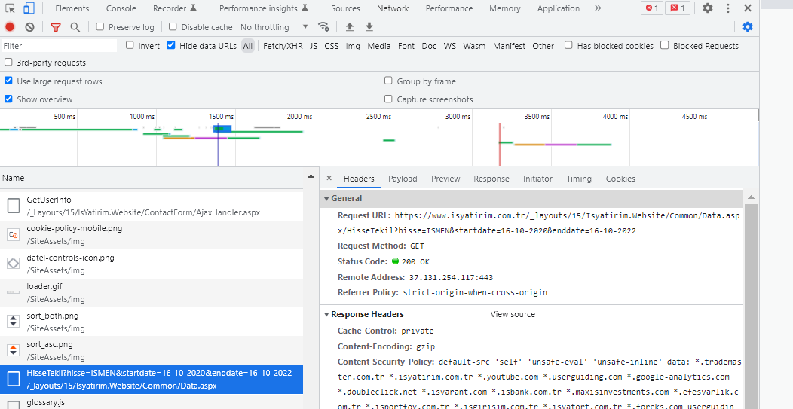

```{r setup, include=FALSE}
knitr::opts_chunk$set(echo = TRUE)
```

Writing functions is an essential part of programming. R already has a plethora of functions that we frequently use. These functions are sometimes built-in, and other times we use a package's functions. As usual, I'd like to use a practical example to demonstrate how to write your own function in this post.

Is Investment is a useful data source for Turkish stock prices. Please follow the steps outlined below; finally, I'll provide some information that I strongly believe will be useful.

i. Unfortunately, when English is chosen as the language, historical price data is not accessible. In this case, we'll use the Turkish URL: https://www.isyatirim.com.tr/tr-tr/analiz/hisse/Sayfalar/Tarihsel-Fiyat-Bilgileri.aspx

ii. Analiz (Analysis), Tarihsel Fiyat Bilgileri (Historical Price Information)

iii. Press F12, then F5 to refresh the page.

```{r echo=FALSE, out.width = "100%"}

```

We have found the main URL we will use, as shown in the image above.

https://www.isyatirim.com.tr/_layouts/15/Isyatirim.Website/Common/Data.aspx/HisseTekil?hisse=ISMEN&startdate=16-10-2020&enddate=16-10-2022

Some parts of the above URL will be determined using the function.

Before moving on to writing a function, I'd like to point out that the above steps can be used to find the URL you need on any website.

There are three key steps to creating a new function ([Wickham H., Grolemund G.](https://r4ds.had.co.nz/functions.html)):

K1. You need to pick a name for the function.

K2. You list the inputs, or arguments, to the function inside function.

K3. You place the code you have developed in body of the function.

In its most basic form, a function is:

```{r eval=FALSE}

a_name_for_the_function <- function(the inputs or arguments){
  
  # the code you have developed
  
}

```

https://www.isyatirim.com.tr/_layouts/15/Isyatirim.Website/Common/Data.aspx/HisseTekil?hisse=ISMEN&startdate=16-10-2020&enddate=16-10-2022

Returning to the URL above, we see that there are three inputs given below that we need from the user.

I1. One or more stock codes or tickers

I2. Start date

I3. End date

```{r eval=FALSE}

histPrices <- function(ticker,startDate,endDate){
  
  # the code you have developed
  
}

```

We can generate the URL shown below using the user's inputs.

```{r}

ticker <- "SASA"
startDate <- "10-10-2022"
endDate <- "14-10-2022"

my_url <- paste0(
  "https://www.isyatirim.com.tr/_layouts/15/Isyatirim.Website/Common/Data.aspx/HisseTekil?hisse=",
  ticker,
  "&startdate=",
  startDate,
  "&enddate=",
  endDate
)

my_url

```

The given URL can be copied and pasted into your browser to see historical SASA stock prices.

```{r echo=FALSE, out.width = "100%"}
knitr::include_graphics("img2.png")
```

We can add .json extension to the URL. The main points of JSON are listed below ([w3schools.com](https://www.w3schools.com/whatis/whatis_json.asp)).

* JSON stands for JavaScript Object Notation

* JSON is a lightweight format for storing and transporting data

* JSON is often used when data is sent from a server to a web page

* JSON is "self-describing" and easy to understand

Then the ultimate URL is:

```{r}

my_url <- paste0(
  "https://www.isyatirim.com.tr/_layouts/15/Isyatirim.Website/Common/Data.aspx/HisseTekil?hisse=",
  ticker,
  "&startdate=",
  startDate,
  "&enddate=",
  endDate,
  ".json"
)

my_url

```

When the above URL is pasted into a browser and executed, the result will be as shown in the previous image.

The {rjson} package's fromJSON function can be used to convert a JSON object into an R object.

```{r}

result <- rjson::fromJSON(file = my_url)

```

```{r echo=FALSE, out.width = "100%"}
knitr::include_graphics("img3.png")
```

A list named result is created.

Using the {purrr} package's invoke function, we can convert the values in the list's value element into a table. The list can then be converted to a data frame using the as.data.frame function.

```{r}

library(dplyr)

df <- purrr::invoke(rbind, result$value)
df_hist <- as.data.frame(df) %>% 
  select(1:3) %>% 
  rename(
    "Ticker"=1,
    "Date"=2,
    "Close"=3
  )

```

```{r echo=FALSE}

library(dplyr)

df_hist %>% 
  kableExtra::kbl(align = "c") %>% 
  kableExtra::kable_paper(full_width = F)

```

Great job! It's time to turn everything we've done so far into a function.

K1. You need to pick a name for the function.

K2. You list the inputs, or arguments, to the function inside function.

I1. One or more stock codes or tickers

I2. Start date

I3. End date

```{r eval=FALSE}

histPrices <- function(ticker,startDate,endDate){
  
  
  
}

```

K3. You place the code you have developed in body of the function.

If the user leaves any input blank, the function returns a message.

Only input names can be written by default, but we will specify that these inputs are NULL.

```{r eval=FALSE}

histPrices <- function(ticker=NULL,startDate=NULL,endDate=NULL){
  
  if(is.null(ticker) | is.null(startDate) | is.null(endDate)){
    
    message("Field is required! You have left a field empty and a value must be entered.")
    
  }
  
}

```

The codes we've written thus far can be placed in the else block.

```{r eval=FALSE}

histPrices <- function(ticker=NULL,startDate=NULL,endDate=NULL){
  
  if(is.null(ticker) | is.null(startDate) | is.null(endDate)){
    
    message("Field is required! You have left a field empty and a value must be entered.")
    
  } else {
    
    my_url <- paste0(
      
      "https://www.isyatirim.com.tr/_layouts/15/Isyatirim.Website/Common/Data.aspx/HisseTekil?hisse=",
      ticker,
      "&startdate=",
      startDate,
      "&enddate=",
      endDate,
      ".json"
      
    )
    
    result <- rjson::fromJSON(file = my_url)
    df <- purrr::invoke(rbind, result$value)
    df_hist <- as.data.frame(df) %>% 
      select(1:3) %>% 
      rename(
        "Ticker"=1,
        "Date"=2,
        "Close"=3
      )
    
  }
  
}

```

Using the assign function, we can send the output to the environment.

```{r}

histPrices <- function(ticker=NULL,startDate=NULL,endDate=NULL){
  
  if(is.null(ticker) | is.null(startDate) | is.null(endDate)){
    
    message("Field is required! You have left a field empty and a value must be entered.")
    
  } else {
    
    my_url <- paste0(
      
      "https://www.isyatirim.com.tr/_layouts/15/Isyatirim.Website/Common/Data.aspx/HisseTekil?hisse=",
      ticker,
      "&startdate=",
      startDate,
      "&enddate=",
      endDate,
      ".json"
      
    )
    
    result <- rjson::fromJSON(file = my_url)
    df <- purrr::invoke(rbind, result$value)
    df_hist <- as.data.frame(df) %>% 
      select(1:3) %>% 
      rename(
        "Ticker"=1,
        "Date"=2,
        "Close"=3
      )
    
    assign(ticker, df_hist, envir=.GlobalEnv)
    
  }
  
}

```

```{r}

histPrices(ticker = "SASA", startDate = "10-10-2022", endDate = "14-10-2022")

```

We have a minor issue that we can fix before sending it to the user.

```{r}

str(SASA)

```

All of the variables are displayed in a list format. Let's convert them to their proper formats.

```{r}

histPrices <- function(ticker=NULL,startDate=NULL,endDate=NULL){
  
  if(is.null(ticker) | is.null(startDate) | is.null(endDate)){
    
    message("Field is required! You have left a field empty and a value must be entered.")
    
  } else {
    
    my_url <- paste0(
      
      "https://www.isyatirim.com.tr/_layouts/15/Isyatirim.Website/Common/Data.aspx/HisseTekil?hisse=",
      ticker,
      "&startdate=",
      startDate,
      "&enddate=",
      endDate,
      ".json"
      
    )
    
    result <- rjson::fromJSON(file = my_url)
    df <- purrr::invoke(rbind, result$value)
    df_hist <- as.data.frame(df) %>% 
      select(1:3) %>% 
      rename(
        "Ticker"=1,
        "Date"=2,
        "Close"=3
      ) %>% 
      mutate(
        Ticker = as.character(Ticker),
        Date = lubridate::dmy(Date),
        Close = as.numeric(Close)
      )
    
    assign(ticker, df_hist, envir=.GlobalEnv)
    
  }
  
}

```

```{r}

histPrices(ticker = "SASA", startDate = "10-10-2022", endDate = "14-10-2022")

```

```{r}

str(SASA)

```

What if the user wants the historical prices of multiple stocks? In this case, we can put a loop inside the function.

We will create the data frame df hist, loop through it as many times as the number of tickers, and then combine it with the master dataframe.

```{r}

histPrices <- function(ticker=NULL,startDate=NULL,endDate=NULL){
  
  if(is.null(ticker) | is.null(startDate) | is.null(endDate)){
    
    message("Field is required! You have left a field empty and a value must be entered.")
    
  } else {
    
    master <- data.frame()
    
    for(i in seq_along(ticker)){
      
      my_url <- paste0(
      
      "https://www.isyatirim.com.tr/_layouts/15/Isyatirim.Website/Common/Data.aspx/HisseTekil?hisse=",
      ticker[i],
      "&startdate=",
      startDate,
      "&enddate=",
      endDate,
      ".json"
      
    )
    
    result <- rjson::fromJSON(file = my_url)
    df <- purrr::invoke(rbind, result$value)
    df_hist <- as.data.frame(df) %>% 
      select(1:3) %>% 
      rename(
        "Ticker"=1,
        "Date"=2,
        "Close"=3
      ) %>% 
      mutate(
        Ticker = as.character(Ticker),
        Date = lubridate::dmy(Date),
        Close = as.numeric(Close)
      )
    
    master <- master %>% 
      bind_rows(df_hist)
      
    }
    
    assign("master", master, envir=.GlobalEnv)
    
  }
  
}

```

```{r}

histPrices(
  
  ticker = c("SASA","THYAO","ASELS","AKBNK","TUPRS","VESTL"),
  startDate = "01-01-2022",
  endDate = "14-10-2022"
  
)

```

We did an excellent job! Following that, we will be able to create our own package.

```{r fig.width=12, fig.height=6, preview=TRUE}

library(ggplot2)

ggplot(master, aes(x = Date, y = Close)) +
  geom_line() +
  facet_wrap(~Ticker, scales = "free_y") +
  ggthemes::theme_fivethirtyeight()

```